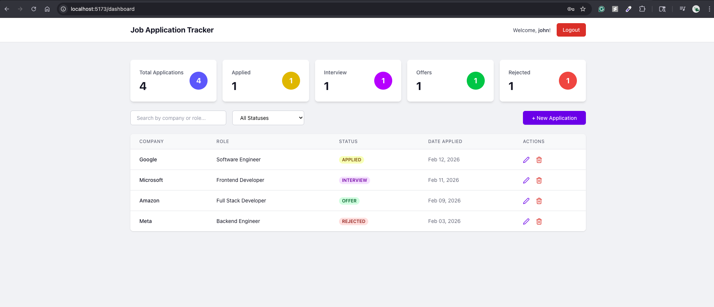
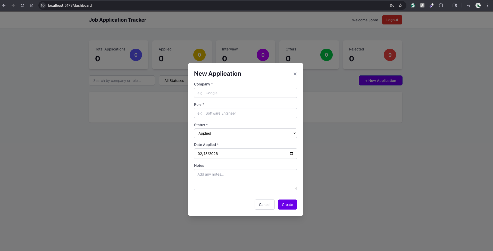
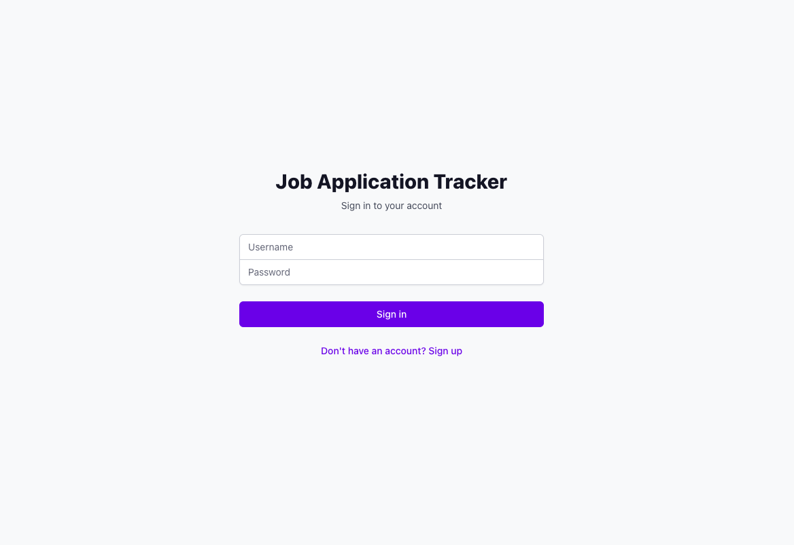
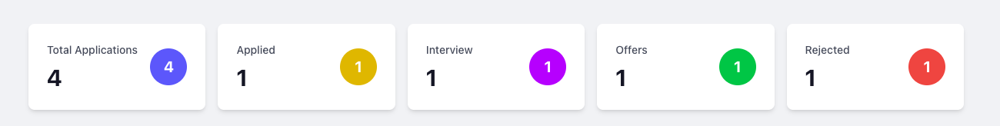

# 📊 Job Application Tracker

> A full-stack web application for managing and tracking job applications with user authentication, CRUD operations, and analytics dashboard.

[](https://reactjs.org/)
[](https://spring.io/projects/spring-boot)
[](https://www.mysql.com/)
[](LICENSE)

[Live Demo](#) | [Report Bug](#) | [Request Feature](#)

---

## 📋 Table of Contents

- [Overview](#-overview)
- [Features](#-features)
- [Tech Stack](#-tech-stack)
- [Screenshots](#-screenshots)
- [Getting Started](#-getting-started)
  - [Prerequisites](#prerequisites)
  - [Installation](#installation)
  - [Configuration](#configuration)
- [Usage](#-usage)
- [API Documentation](#-api-documentation)
- [Project Structure](#-project-structure)
- [Development](#-development)
- [Deployment](#-deployment)
- [Contributing](#-contributing)
- [License](#-license)
- [Contact](#-contact)
- [Acknowledgments](#-acknowledgments)

---

## 🎯 Overview

Job Application Tracker is a comprehensive full-stack application designed to help job seekers organize and manage their job search process. Built with modern technologies, it provides an intuitive interface for tracking application statuses, maintaining detailed records, and visualizing job search progress through an analytics dashboard.

### Why This Project?

During a job search, keeping track of multiple applications can be overwhelming. This application solves that problem by providing:

- **Centralized Management**: All your applications in one place
- **Status Tracking**: Monitor progress from application to offer
- **Search & Filter**: Quickly find specific applications
- **Analytics**: Visualize your job search with statistics
- **Secure**: JWT-based authentication keeps your data private

---

## ✨ Features

### 🔐 Authentication & Security

- User registration with email validation
- Secure login with JWT (JSON Web Tokens)
- Password encryption using BCrypt
- Protected routes and automatic session management
- Token expiration and auto-logout

### 📝 Application Management

- **Create** new job applications with detailed information
- **Read** and view all applications in a sortable table
- **Update** application status and details
- **Delete** applications with confirmation
- Soft delete functionality (data recovery possible)

### 🔍 Advanced Features

- **Search**: Find applications by company name or job role
- **Filter**: Filter by application status (Applied, Interview, Offer, Rejected)
- **Pagination**: Navigate through applications efficiently (10 per page)
- **Sort**: Order by date, company, or status
- **Statistics Dashboard**: Real-time analytics with visual cards

### 🎨 User Interface

- Responsive design (mobile, tablet, desktop)
- Intuitive and clean interface
- Loading states and error handling
- Toast notifications for user feedback
- Color-coded status badges
- Smooth transitions and animations

### 📊 Analytics

- Total applications count
- Breakdown by status (Applied, Interview, Offer, Rejected)
- Real-time updates after CRUD operations
- Visual statistics cards

---

## 🛠 Tech Stack

### Backend

- **Framework**: Spring Boot 3.2.0
- **Language**: Java 21
- **Security**: Spring Security with JWT
- **Database**: MySQL 9.3.0
- **ORM**: Spring Data JPA (Hibernate)
- **Build Tool**: Maven
- **Documentation**: Swagger/OpenAPI
- **Libraries**:
  - Lombok (boilerplate reduction)
  - JJWT (JWT implementation)
  - Validation API (input validation)

### Frontend

- **Framework**: React 18
- **Build Tool**: Vite
- **Styling**: Tailwind CSS
- **Routing**: React Router DOM v6
- **HTTP Client**: Axios
- **State Management**: React Context API
- **UI Components**:
  - React Hot Toast (notifications)
  - React Icons (icons)
  - date-fns (date formatting)
  - React Hook Form (form handling)

### Database

- **DBMS**: MySQL 9.3
- **Schema**:
  - Users table (authentication)
  - Roles table (authorization)
  - User-Roles junction table (many-to-many)
  - Job Applications table (application data)

### DevOps & Tools

- **Version Control**: Git & GitHub
- **IDE**: VS Code / IntelliJ IDEA
- **API Testing**: Postman
- **Database Management**: MySQL Workbench

---

## 📸 Screenshots

### Dashboard


_Main dashboard showing statistics and application list_

### Application Form


_Modal form for creating/editing applications_

### Login Page


_User authentication page_

### Statistics


_Real-time analytics dashboard_

---

## 🚀 Getting Started

### Prerequisites

Before you begin, ensure you have the following installed:

- **Java Development Kit (JDK)** 17 or higher

```bash
  java -version
```

- **Maven** 3.8+

```bash
  mvn -version
```

- **MySQL** 8.0+

```bash
  mysql --version
```

- **Node.js** 18+ and npm

```bash
  node -version
  npm -version
```

- **Git**

```bash
  git --version
```

---

### Installation

#### 1. Clone the Repository

```bash
git clone https://github.com/christrodrigues/job-application-tracker.git
cd job-application-tracker
```

#### 2. Backend Setup

**Navigate to backend directory:**

```bash
cd backend
```

**Configure Database:**

Create a MySQL database:

```sql
CREATE DATABASE job_tracker;
```

**Update `application.properties`:**

```properties
# src/main/resources/application.properties
spring.datasource.url=jdbc:mysql://localhost:3306/job_tracker
spring.datasource.username=YOUR_MYSQL_USERNAME
spring.datasource.password=YOUR_MYSQL_PASSWORD
```

**Create Database Tables:**

The tables will be created automatically by Hibernate, but you need to insert default roles:

```sql
USE job_tracker;

CREATE TABLE roles (
    id BIGINT PRIMARY KEY AUTO_INCREMENT,
    name VARCHAR(20) NOT NULL UNIQUE
);

INSERT INTO roles (name) VALUES ('ROLE_USER');
INSERT INTO roles (name) VALUES ('ROLE_ADMIN');
```

**Install Dependencies & Run:**

```bash
mvn clean install
mvn spring-boot:run
```

Backend will start at `http://localhost:8080`

#### 3. Frontend Setup

**Open a new terminal and navigate to frontend directory:**

```bash
cd ../frontend
```

**Install Dependencies:**

```bash
npm install
```

**Configure API URL (if needed):**

The default API URL is `http://localhost:8080/api`. If you change this, update:

```javascript
// src/services/api.js
const API_BASE_URL = "http://localhost:8080/api";
```

**Run Development Server:**

```bash
npm run dev
```

Frontend will start at `http://localhost:5173`

---

### Configuration

#### Backend Configuration

**JWT Secret Key** (`application.properties`):

```properties
jwt.secret=YourSecretKeyHereMustBeAtLeast512BitsLongForHS512Algorithm
jwt.expiration=86400000
```

⚠️ **Important**: Generate a strong secret key for production:

```bash
openssl rand -base64 64
```

**CORS Configuration** (`CorsConfig.java`):

```java
corsConfiguration.setAllowedOrigins(Arrays.asList(
    "http://localhost:3000",
    "http://localhost:5173",
    "https://your-production-domain.com"
));
```

#### Frontend Configuration

**Environment Variables** (create `.env` file):

```env
VITE_API_URL=http://localhost:8080/api
```

---

## 💻 Usage

### 1. Register a New Account

1. Navigate to `http://localhost:5173`
2. Click "Don't have an account? Sign up"
3. Fill in:
   - Username (3-20 characters)
   - Email (valid email address)
   - Password (minimum 6 characters)
4. Click "Sign up"

### 2. Login

1. Enter your username and password
2. Click "Sign in"
3. You'll be redirected to the dashboard

### 3. Create a Job Application

1. Click "New Application" button
2. Fill in the form:
   - **Company**: e.g., Google
   - **Role**: e.g., Software Engineer
   - **Status**: Applied, Interview, Offer, or Rejected
   - **Date Applied**: Select date
   - **Notes**: Optional additional information
3. Click "Create"

### 4. Manage Applications

- **Edit**: Click the pencil icon to update details
- **Delete**: Click the trash icon to remove (with confirmation)
- **Search**: Type in search box to find by company or role
- **Filter**: Select status from dropdown to filter
- **Paginate**: Use Previous/Next buttons to navigate

### 5. View Statistics

The dashboard automatically displays:

- Total applications
- Applications by status (Applied, Interview, Offer, Rejected)
- Real-time updates after any changes

---

## 📚 API Documentation

### Authentication Endpoints

#### Register User

```http
POST /api/auth/signup
Content-Type: application/json

{
  "username": "john",
  "email": "john@example.com",
  "password": "password123"
}
```

**Response:**

```json
{
  "message": "User registered successfully!"
}
```

#### Login

```http
POST /api/auth/login
Content-Type: application/json

{
  "username": "john",
  "password": "password123"
}
```

**Response:**

```json
{
  "token": "eyJhbGciOiJIUzUxMiJ9...",
  "type": "Bearer",
  "id": 1,
  "username": "john",
  "email": "john@example.com",
  "roles": ["ROLE_USER"]
}
```

### Job Application Endpoints

All endpoints require JWT token in Authorization header:

```
Authorization: Bearer <your-jwt-token>
```

#### Get All Applications

```http
GET /api/applications?page=0&size=10&sortBy=dateApplied&direction=desc&status=APPLIED&keyword=google
```

**Query Parameters:**

- `page`: Page number (default: 0)
- `size`: Items per page (default: 10)
- `sortBy`: Sort field (dateApplied, company, role, status)
- `direction`: Sort direction (asc, desc)
- `status`: Filter by status (APPLIED, INTERVIEW, OFFER, REJECTED)
- `keyword`: Search term for company/role

#### Create Application

```http
POST /api/applications
Content-Type: application/json
Authorization: Bearer <token>

{
  "company": "Google",
  "role": "Software Engineer",
  "status": "APPLIED",
  "dateApplied": "2026-02-10",
  "notes": "Applied through LinkedIn"
}
```

#### Update Application

```http
PUT /api/applications/{id}
Content-Type: application/json
Authorization: Bearer <token>

{
  "status": "INTERVIEW",
  "notes": "Phone screen scheduled"
}
```

#### Delete Application

```http
DELETE /api/applications/{id}
Authorization: Bearer <token>
```

#### Get Statistics

```http
GET /api/applications/stats
Authorization: Bearer <token>
```

**Response:**

```json
{
  "total": 25,
  "applied": 10,
  "interview": 8,
  "offer": 2,
  "rejected": 5
}
```

### Interactive API Documentation

Once the backend is running, access Swagger UI:

```
http://localhost:8080/swagger-ui.html
```

---

## 📁 Project Structure

```
job-application-tracker/
│
├── backend/                          # Spring Boot Backend
│   ├── src/
│   │   ├── main/
│   │   │   ├── java/com/jobtracker/
│   │   │   │   ├── controller/      # REST Controllers
│   │   │   │   │   ├── AuthController.java
│   │   │   │   │   ├── JobApplicationController.java
│   │   │   │   │   └── TestController.java
│   │   │   │   │
│   │   │   │   ├── service/         # Business Logic
│   │   │   │   │   ├── AuthService.java
│   │   │   │   │   └── JobApplicationService.java
│   │   │   │   │
│   │   │   │   ├── repository/      # Data Access Layer
│   │   │   │   │   ├── UserRepository.java
│   │   │   │   │   ├── RoleRepository.java
│   │   │   │   │   └── JobApplicationRepository.java
│   │   │   │   │
│   │   │   │   ├── entity/          # JPA Entities
│   │   │   │   │   ├── User.java
│   │   │   │   │   ├── Role.java
│   │   │   │   │   ├── ERole.java
│   │   │   │   │   ├── JobApplication.java
│   │   │   │   │   └── ApplicationStatus.java
│   │   │   │   │
│   │   │   │   ├── security/        # JWT & Security
│   │   │   │   │   ├── JwtUtils.java
│   │   │   │   │   ├── UserDetailsImpl.java
│   │   │   │   │   ├── UserDetailsServiceImpl.java
│   │   │   │   │   ├── AuthTokenFilter.java
│   │   │   │   │   └── AuthEntryPointJwt.java
│   │   │   │   │
│   │   │   │   ├── config/          # Configuration
│   │   │   │   │   ├── SecurityConfig.java
│   │   │   │   │   ├── CorsConfig.java
│   │   │   │   │   ├── OpenAPIConfig.java
│   │   │   │   │   └── RequestLoggingFilter.java
│   │   │   │   │
│   │   │   │   ├── dto/             # Data Transfer Objects
│   │   │   │   │   ├── AuthDTOs.java
│   │   │   │   │   └── JobApplicationDTOs.java
│   │   │   │   │
│   │   │   │   └── exception/       # Exception Handling
│   │   │   │       ├── CustomExceptions.java
│   │   │   │       └── GlobalExceptionHandler.java
│   │   │   │
│   │   │   └── resources/
│   │   │       └── application.properties
│   │   │
│   │   └── test/                    # Unit Tests
│   │
│   └── pom.xml                      # Maven Dependencies
│
├── frontend/                         # React Frontend
│   ├── public/                      # Static Assets
│   │
│   ├── src/
│   │   ├── components/              # Reusable Components
│   │   │   ├── StatisticsCards.jsx
│   │   │   ├── ApplicationModal.jsx
│   │   │   ├── ApplicationsTable.jsx
│   │   │   ├── ProtectedRoute.jsx
│   │   │   └── DeleteConfirmModal.jsx
│   │   │
│   │   ├── pages/                   # Page Components
│   │   │   ├── Login.jsx
│   │   │   ├── Signup.jsx
│   │   │   └── Dashboard.jsx
│   │   │
│   │   ├── services/                # API Services
│   │   │   ├── api.js
│   │   │   ├── authService.js
│   │   │   └── jobApplicationService.js
│   │   │
│   │   ├── context/                 # React Context
│   │   │   └── AuthContext.jsx
│   │   │
│   │   ├── App.jsx                  # Main App Component
│   │   ├── main.jsx                 # Entry Point
│   │   └── index.css                # Global Styles
│   │
│   ├── package.json                 # NPM Dependencies
│   ├── vite.config.js              # Vite Configuration
│   └── tailwind.config.js          # Tailwind Configuration
│
├── .gitignore                       # Git Ignore Rules
└── README.md                        # This File
```

---

## 🔧 Development

### Running Tests

**Backend:**

```bash
cd backend
mvn test
```

**Frontend:**

```bash
cd frontend
npm test
```

### Code Formatting

**Backend (Google Java Format):**

```bash
mvn com.coveo:fmt-maven-plugin:format
```

**Frontend (Prettier):**

```bash
npm run format
```

### Building for Production

**Backend:**

```bash
cd backend
mvn clean package
# Creates executable JAR in target/
```

**Frontend:**

```bash
cd frontend
npm run build
# Creates optimized build in dist/
```

---

## 🌐 Deployment

### Backend Deployment (Heroku Example)

1. **Create Heroku App:**

```bash
heroku create your-app-name-backend
```

2. **Add MySQL Add-on:**

```bash
heroku addons:create jawsdb:kitefin
```

3. **Set Environment Variables:**

```bash
heroku config:set JWT_SECRET=your-secret-key
```

4. **Deploy:**

```bash
git subtree push --prefix backend heroku main
```

### Frontend Deployment (Vercel Example)

1. **Install Vercel CLI:**

```bash
npm install -g vercel
```

2. **Deploy:**

```bash
cd frontend
vercel
```

3. **Set Environment Variables:**

```bash
vercel env add VITE_API_URL
# Enter your backend URL
```

### Alternative Deployment Options

**Backend:**

- Railway.app
- Render
- AWS Elastic Beanstalk
- Google Cloud Run
- DigitalOcean App Platform

**Frontend:**

- Netlify
- GitHub Pages
- AWS Amplify
- Firebase Hosting

---

## 🤝 Contributing

Contributions are welcome! Please follow these steps:

1. **Fork the repository**
2. **Create a feature branch**

```bash
   git checkout -b feature/AmazingFeature
```

3. **Commit your changes**

```bash
   git commit -m 'Add some AmazingFeature'
```

4. **Push to the branch**

```bash
   git push origin feature/AmazingFeature
```

5. **Open a Pull Request**

### Development Guidelines

- Follow existing code style and conventions
- Write meaningful commit messages
- Add tests for new features
- Update documentation as needed
- Ensure all tests pass before submitting PR

---

## 📄 License

This project is licensed under the MIT License - see the [LICENSE](LICENSE) file for details.

---

## 👤 Contact

**Your Name**

- GitHub: [@christrodrigues](https://github.com/christrodrigues)
- LinkedIn: [Your LinkedIn](https://linkedin.com/in/yourprofile)
- Email: your.email@example.com
- Portfolio: [your-portfolio.com](https://your-portfolio.com)

**Project Link:** [https://github.com/christrodrigues/job-application-tracker](https://github.com/christrodrigues/job-application-tracker)

---

## 🙏 Acknowledgments

- [Spring Boot](https://spring.io/projects/spring-boot) - Backend framework
- [React](https://reactjs.org/) - Frontend library
- [Tailwind CSS](https://tailwindcss.com/) - CSS framework
- [JWT.io](https://jwt.io/) - JWT documentation
- [Vite](https://vitejs.dev/) - Build tool
- [MySQL](https://www.mysql.com/) - Database
- [React Icons](https://react-icons.github.io/react-icons/) - Icon library
- [date-fns](https://date-fns.org/) - Date formatting
- [Axios](https://axios-http.com/) - HTTP client

---

## 📊 Project Stats


---

<div align="center">

**Made with ❤️ by Christ Rodrigues**

[⬆ Back to Top](#-job-application-tracker)

</div>
